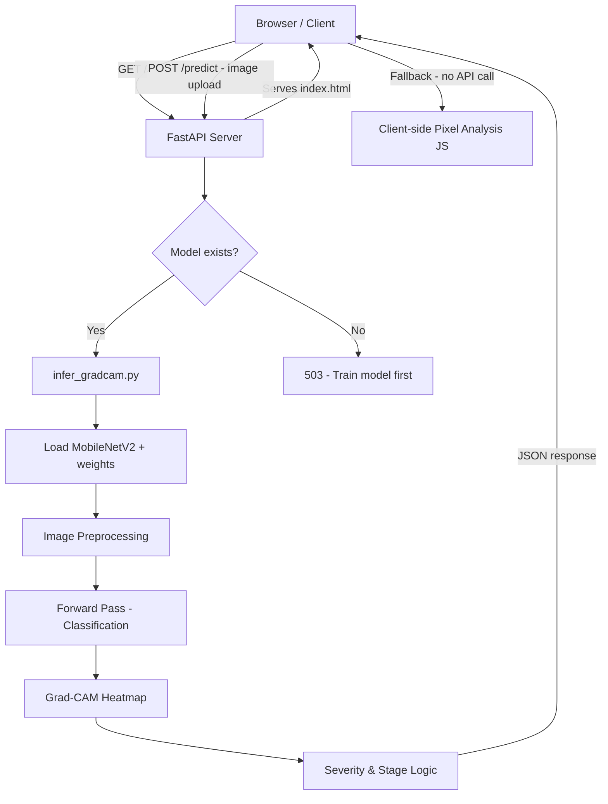

# 🍅 Tomato Leaf Disease Early Prediction
---
[](https://drowsiness-detection-system-99de.onrender.com)

## 1. Overview

### What the project does
An AI-powered web application that analyzes tomato leaf images to detect plant diseases at their earliest stages — before visible symptoms fully develop.

### Problem it solves
Tomato crops are vulnerable to multiple fungal, bacterial, and viral diseases. By the time a farmer visually identifies a problem, significant damage has already occurred. This system provides **early-stage disease detection** through deep learning and Grad-CAM visualization, giving farmers a chance to intervene before crop loss escalates.

### Key Features
- 📤 Upload any tomato leaf image via a clean browser UI
- 🧠 MobileNetV2-based classifier trained on 11 disease categories
- 🔥 Grad-CAM heatmap overlay highlighting the infected region
- 📊 Severity score, infection stage, and future risk level
- 🟢 Early warning system — flags possible infection even on leaves the model classifies as "healthy"
- ⚡ Client-side pixel analysis as instant fallback (no model required for basic use)
- 🌐 REST API endpoint (`/predict`) for programmatic access

### Tech Stack
- **Backend:** Python, FastAPI, PyTorch, OpenCV
- **ML Model:** MobileNetV2 (transfer learning) + Grad-CAM
- **Frontend:** Vanilla HTML/CSS/JavaScript (single-file, no framework)
- **Server:** Uvicorn (ASGI)

---

## 2. Demo

### Live URL
```
http://localhost:8000
```
Run the server locally (see Installation section), then open the above URL in your browser.

### API Documentation
FastAPI auto-generates interactive docs at:
```
http://localhost:8000/docs       # Swagger UI
http://localhost:8000/redoc      # ReDoc
```

---

## 3. Architecture

### High-Level Architecture



### Components

| Component | File | Responsibility |
|-----------|------|----------------|
| Web Server | `api.py` | FastAPI app, routes, file upload handling |
| Inference Engine | `infer_gradcam.py` | Model loading, classification, Grad-CAM, severity scoring |
| Training Pipeline | `train_tomato.py` | Data loading, MobileNetV2 fine-tuning, model checkpointing |
| Frontend | `index.html` | UI, image preview, client-side analysis, result rendering |

### Request Flow

1. User opens `http://localhost:8000` → served `index.html`
2. User uploads a leaf image and clicks **Analyze leaf**
3. Client-side JS runs a pixel-level color analysis instantly (green/yellow/lesion ratios)
4. *(With trained model)* Image is POSTed to `/predict` → temp file saved → `infer()` called
5. MobileNetV2 classifies the image → Grad-CAM generates heatmap → severity/stage computed
6. JSON result returned and rendered in the results panel with an overlay visualization

---

## 4. Tech Stack

| Layer | Technology | Why |
|-------|-----------|-----|
| Web Framework | FastAPI | Async-ready, auto-generates OpenAPI docs, minimal boilerplate |
| ML Framework | PyTorch | Flexible for custom training loops and Grad-CAM hooks |
| Model | MobileNetV2 | Lightweight, fast inference, high accuracy — ideal for leaf classification |
| Explainability | Grad-CAM | Visualizes *which* region triggered the prediction — critical for trust |
| Image Processing | OpenCV + Pillow | Heatmap generation, image I/O, color space conversions |
| Frontend | Vanilla JS | Zero dependencies, instant load, works offline for basic analysis |
| ASGI Server | Uvicorn | Production-grade async server for FastAPI |

---

## 5. Project Structure

```
Tomato_disease_early_prediction/
│
├── api.py                  # FastAPI app — HTTP routes and upload handling
├── infer_gradcam.py        # Core ML inference: classification + Grad-CAM + severity
├── train_tomato.py         # Training script — fine-tunes MobileNetV2 on tomato dataset
├── index.html              # Single-file frontend with UI and client-side analysis
├── requirements.txt        # Python dependencies
├── sample_leaf.jpg         # Sample image for quick testing
│
├── models/                 # Auto-created by training
│   └── best_model.pth      # Saved model checkpoint (weights + class names)
│
├── data/                   # Training data (not included — download separately)
│   ├── train/
│   │   ├── Tomato_Bacterial_spot/
│   │   ├── Tomato_Early_blight/
│   │   ├── Tomato_healthy/
│   │   └── ... (11 classes total)
│   └── valid/
│       └── ... (mirrored structure)
│
└── gradcam_output.jpg      # Generated after inference — Grad-CAM overlay image
```

**Key folder responsibilities:**
- `models/` — stores the best checkpoint saved during training; loaded at inference time
- `data/` — ImageFolder-compatible structure expected by `train_tomato.py`
- Root — all source files live flat for simplicity

---

## 6. Database Design

This project is **stateless** — no database is used. All state lives in:
- `models/best_model.pth` — the trained model weights (file-based persistence)
- In-memory during inference — image tensor, predictions, Grad-CAM maps

### Class Labels (11 categories)

| # | Class |
|---|-------|
| 1 | Tomato Bacterial Spot |
| 2 | Tomato Early Blight |
| 3 | Tomato Late Blight |
| 4 | Tomato Leaf Mold |
| 5 | Tomato Septoria Leaf Spot |
| 6 | Tomato Spider Mites |
| 7 | Tomato Target Spot |
| 8 | Tomato Mosaic Virus |
| 9 | Tomato Yellow Leaf Curl Virus |
| 10 | Tomato Healthy |
| 11 | *(dataset-specific additional class)* |

---

## 7. API Overview

### Endpoints

| Method | Path | Description |
|--------|------|-------------|
| `GET` | `/` | Serves the frontend HTML page |
| `POST` | `/predict` | Accepts an image, returns disease prediction |
| `GET` | `/docs` | Swagger interactive API docs |

### Authentication
No authentication required. This is designed for local/internal use. For production, add API key or OAuth2 middleware.

### POST `/predict`

**Request**
```
Content-Type: multipart/form-data

file: <image file>   (JPEG, PNG, etc.)
```

**Success Response** `200 OK`
```json
{
  "disease": "Tomato Early Blight",
  "confidence": 0.9231,
  "severity": 18.45,
  "stage": "EARLY",
  "risk": "HIGH",
  "early_warning": false,
  "early_note": "No",
  "gradcam_saved": "gradcam_output.jpg"
}
```

**Error Responses**

| Code | Reason |
|------|--------|
| `400` | Uploaded file is not an image |
| `503` | Model checkpoint not found — run training first |
| `500` | Inference failed (dependency or runtime error) |

---

## 8. Key Features

### 🧠 Deep Learning Classification
MobileNetV2 fine-tuned on the PlantVillage tomato dataset (11 classes). Transfer learning from ImageNet weights provides strong generalization with minimal training data.

### 🔥 Grad-CAM Explainability
Gradient-weighted Class Activation Mapping hooks into the last feature map layer (`features[18]`) to produce a heatmap showing exactly which region of the leaf drove the prediction. The overlay is saved as `gradcam_output.jpg`.

### 🟢 Early Warning for Healthy Leaves
Even when the model classifies a leaf as "Healthy", the Grad-CAM activation area is measured. If a hotspot covers more than 3% of the leaf, an early warning is raised — catching infections before they are visually obvious enough for classification.

### 📊 Severity Staging
The Grad-CAM activation map is thresholded at 0.3 to count "infected pixels" as a percentage of total leaf area:

| Severity | Stage | Risk |
|----------|-------|------|
| < 5% | VERY EARLY / MINIMAL | LOW to MEDIUM |
| 5–20% | EARLY | HIGH |
| 20–30% | MODERATE | VERY HIGH |
| > 30% | SEVERE | CRITICAL |

### ⚡ Client-Side Fallback Analysis
When no trained model is available, the browser performs instant pixel-level analysis using Canvas API — classifying based on green/yellow/lesion pixel ratios. No server round-trip needed.

---

## 9. Security

### Input Validation
- `Content-Type` is checked — only `image/*` MIME types are accepted
- File is written to a `tempfile` and deleted immediately after inference (no persistent user uploads)

### No Authentication (Current State)
The app is designed for local development. For deployment:
- Add FastAPI `Depends` with API key or OAuth2 bearer token
- Enable HTTPS via a reverse proxy (Nginx + Let's Encrypt)

### CORS
Not configured by default (local use). For cross-origin access, add:
```python
from fastapi.middleware.cors import CORSMiddleware
app.add_middleware(CORSMiddleware, allow_origins=["*"])
```

### Dependency Safety
- Model is loaded with `map_location=DEVICE` — avoids executing arbitrary code from `.pth` files on the wrong device
- Temporary files are cleaned up in a `finally` block, preventing disk exhaustion

---

## 10. Performance & Scalability

### Image Resizing
All images are resized to **160×160** before inference. This reduces memory usage and inference time significantly compared to the standard 224×224 while maintaining strong accuracy for leaf classification.

### Lazy Model Loading
The model is loaded on each `/predict` request. For production with high traffic, cache the loaded model in a module-level variable or use FastAPI's `lifespan` startup event:

```python
@app.on_event("startup")
async def load():
    app.state.model, app.state.classes = load_model()
```

### Device Selection
Inference automatically uses the best available hardware:
```
MPS (Apple Silicon) → CUDA (NVIDIA GPU) → CPU
```

### Async Upload Handling
The `/predict` endpoint is `async` and uses `await file.read()` — the ASGI server (Uvicorn) handles concurrent requests without blocking.

### Scaling Considerations
- Add a model inference cache (Redis) keyed on image hash to avoid re-processing identical uploads
- For high-volume use, move inference to a worker queue (Celery + Redis) and return a job ID
- Containerize with Docker and scale horizontally behind a load balancer

---

## 11. Installation

### Prerequisites
- Python 3.9+
- pip

### 1. Clone the repository
```bash
git clone https://github.com/your-username/tomato-disease-early-prediction.git
cd tomato-disease-early-prediction
```

### 2. Create a virtual environment
```bash
python -m venv .venv

# Windows
.venv\Scripts\activate

# macOS / Linux
source .venv/bin/activate
```

### 3. Install dependencies
```bash
pip install -r requirements.txt
pip install torch torchvision --index-url https://download.pytorch.org/whl/cpu
```
> For GPU support, replace `cpu` with `cu121` (CUDA 12.1) in the PyTorch install URL.

### 4. Environment variables
No `.env` file required for local use. The model path and data directory are configured directly in `train_tomato.py` and `infer_gradcam.py`:
```python
MODEL_PATH = "models/best_model.pth"
DATA_DIR   = "data"
```

### 5. (Optional) Train the model
Download the [PlantVillage Tomato dataset](https://www.kaggle.com/datasets/emmarex/plantdisease) and organize it as:
```
data/
  train/  <class_name>/  *.jpg
  valid/  <class_name>/  *.jpg
```
Then run:
```bash
python train_tomato.py
```
Training takes ~10 epochs and saves the best checkpoint to `models/best_model.pth`.

### 6. Run the application
```bash
python -m uvicorn api:app --reload --host 0.0.0.0 --port 8000
```
Open `http://localhost:8000` in your browser.

---

## 12. Deployment

### Docker
Create a `Dockerfile`:
```dockerfile
FROM python:3.11-slim

WORKDIR /app
COPY requirements.txt .
RUN pip install --no-cache-dir -r requirements.txt \
    && pip install torch torchvision --index-url https://download.pytorch.org/whl/cpu

COPY . .

EXPOSE 8000
CMD ["uvicorn", "api:app", "--host", "0.0.0.0", "--port", "8000"]
```

Build and run:
```bash
docker build -t tomato-detector .
docker run -p 8000:8000 -v $(pwd)/models:/app/models tomato-detector
```

### Cloud Deployment
| Platform | Approach |
|----------|----------|
| **Railway / Render** | Connect GitHub repo, set start command to `uvicorn api:app --host 0.0.0.0 --port $PORT` |
| **AWS EC2** | Deploy Docker container, use Nginx as reverse proxy |
| **Google Cloud Run** | Push Docker image to GCR, deploy as a managed container |

### CI/CD (GitHub Actions example)
```yaml
name: Deploy
on:
  push:
    branches: [main]
jobs:
  build:
    runs-on: ubuntu-latest
    steps:
      - uses: actions/checkout@v3
      - run: pip install -r requirements.txt
      - run: python -m pytest tests/ -v   # if tests exist
```

---

## 13. Future Improvements

- [ ] **Real-time webcam analysis** — stream frames from a camera for live field detection
- [ ] **Mobile app** — React Native or Flutter frontend using the `/predict` API
- [ ] **Model retraining pipeline** — allow users to submit corrected labels and retrain incrementally
- [ ] **Multi-crop support** — extend beyond tomato to pepper, potato, corn
- [ ] **Severity trend tracking** — track the same plant over multiple scans to monitor disease progression
- [ ] **Offline PWA** — package as a Progressive Web App with on-device TensorFlow.js model
- [ ] **Authentication & multi-user** — farmer accounts, scan history, per-user dashboards
- [ ] **Multilingual UI** — translate to regional agricultural languages (Hindi, Tamil, Telugu, etc.)
- [ ] **Export report as PDF** — generate a shareable diagnosis report per scan

---

## 14. Talking Points

### Why these technologies?

**FastAPI over Flask/Django:** FastAPI gives automatic OpenAPI documentation, native async support, and Pydantic validation out of the box. For an ML API that needs to handle file uploads and return structured JSON, it is the cleanest choice with the least boilerplate.

**MobileNetV2 over ResNet/VGG:** MobileNetV2 uses depthwise separable convolutions — 10× fewer parameters than ResNet-50 with comparable accuracy on image classification. For a leaf disease task, it hits the right balance of speed and accuracy, and the model file stays small enough to deploy easily.

**Grad-CAM for explainability:** Pure classification ("87% Early Blight") is not enough for a farmer making treatment decisions. Grad-CAM makes the model interpretable by showing *where* it found evidence of disease. This is also the mechanism for the early-warning system — detecting subtle hotspots on leaves that look healthy to the classifier.

### Biggest Challenge
Designing the **early detection logic** — the model's training signal is class labels, not severity. A leaf with 3% infection looks "Healthy" to the classifier. The key insight was using Grad-CAM not just as a visualization tool but as a signal: if the activation map has a hotspot even on a "Healthy" prediction, that is a warning worth surfacing. Tuning the 3% threshold required testing against real early-infection images.

### Trade-offs
- **160px image size vs 224px:** Faster inference and smaller memory footprint, but slightly reduced accuracy on fine-grained lesion textures. Acceptable trade-off for a real-time web app.
- **Client-side fallback vs full ML:** The pixel-ratio analysis in JS is fast but simplistic. It was added so the UI is usable even without a trained model, but it should never replace the neural network for actual diagnoses.
- **Stateless design vs database:** Keeping the app stateless makes it easier to deploy and scale, but means scan history and user data are not persisted. A real production system would need a database for this.

